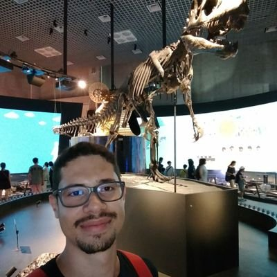

I'm a MSc student at [I4Soft](http://i4soft.com.br){:target="_blank"}, [Universidade Federal de Goiás](https://www.ufg.br){:target="_blank"}, Brazil.
My advisor is [Celso Camilo-Junior](http://www.inf.ufg.br/~celso/){:target="_blank"} and my research is focused in Computational Intelligence and Automated Program Repair. I hold a Computer Science bachelor from the same university where I'm doing my master's research.

<small>
[Twitter](https://twitter.com/eduardodx){:target="_blank"} &nbsp;•&nbsp;
[GitHub](https://github.com/eduardodx){:target="_blank"} &nbsp;•&nbsp;
[Instagram](https://www.instagram.com/dxeduardo){:target="_blank"} &nbsp;•&nbsp;
[Last.fm](https://www.last.fm/user/eduardodx){:target="_blank"} &nbsp;•&nbsp;
[G Scholar](https://scholar.google.com.br/citations?user=s1n7GqkAAAAJ){:target="_blank"}
</small>

  
    

        {{ post.date | date: "%Y.%m.%d" }}
        <a href="{{ post.url }}" class="post-title">{{ post.title }}</a>
        <!-- 
{{ post.excerpt  | strip_html }}
 -->
        <ul class="post-tags">
            
                <li>#{{ tag }}</li>
            
        </ul>
    

  

 <!-- .posts-index -->
